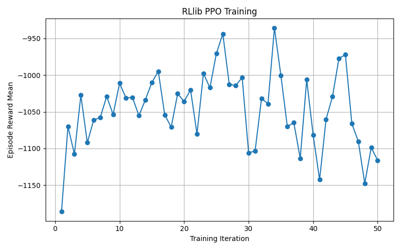

# Report — RLlib Experiments on Grid'5000 (Single-node vs Multi-node)

**Student:** Eya Ridene

**Execution platform:** Grid'5000 (Grenoble – dahu cluster)

**RL library:** Ray RLlib

**Algorithm:** PPO (Proximal Policy Optimization)

**Environment:** CartPole-v1  / Pendulum-v1

---

## 1) Goal

The objective of this work is to demonstrate **distributed RL training execution** with Ray RLlib on Grid'5000 and to evaluate the **performance impact of scaling across nodes**.

We run the **same RL training workload** twice:

- **1 node (single-machine execution)**  

  Ray is started locally on the compute node. All RLlib components (driver + sampling actors) run on the same physical machine.

- **2 nodes (distributed execution using a Ray cluster)**  

  We start a **Ray head** process on one node and a **Ray worker** process on the second node, then run RLlib, which automatically connects to the existing Ray cluster. RLlib distributes its **sampling actors** (EnvRunners) across both nodes.

The main question addressed is:

> **Does increasing parallelism and distributing sampling across multiple nodes reduce training time and improve execution performance?**

---

## 2) Implementation overview

Two Python scripts were developed:

### 2.1 Training script (train_rllib.py)

This script trains a PPO agent using RLlib.

**Key characteristics:**

- Configurable environment (default: CartPole-v1)
- Configurable parallelism via `--num-env-runners`
- Optional GPU usage (`--use-gpu`)
- Configurable number of training iterations (`--iterations`)
- Automatic Ray initialization, compatible with both local and cluster execution
- Logging of results to a CSV file

At each training iteration, the script records:

- Mean episode reward
- Duration of the training iteration (seconds)

These metrics are saved to:

- `results/rewards.csv`

This design separates training from analysis, enabling reproducible evaluation.

### 2.2 Evaluation and visualization (evaluate.py)

This script performs offline evaluation:

- Reads `results/rewards.csv`
- Extracts:
  - Training iteration index
  - Mean episode reward
- Generates a reward-vs-iteration plot
- Saves the figure as:
  - `results/episode_reward_plot.png`

The script uses a headless plotting backend, making it compatible with remote cluster execution.
---

## 3) Experiment setup

### 3.1 Common settings

The following settings are shared across all experiments:

- **Algorithm:** PPO (RLlib)
- **Training length:** Fixed number of iterations for the same environment testing
- **Metrics collected:**
  - Mean episode reward
  - Iteration execution time
- **logging mechanism**

The only intended differences between experiments are:

- Number of compute nodes (1 vs 2)
- Number of environment runners (`num_env_runners`)
- Environment used (CartPole-v1, Pendulum-v1)

Two Gymnasium environments were used:

- **CartPole-v1** : A lightweight, discrete-control environment that converges quickly.

- **Pendulum-v1** : A continuous-control environment with higher per-step computation cost.

### 3.2 Single-node execution

- One Grid'5000 compute node is reserved
- Ray is started locally on that node
- All rollout workers run on the same machine

**Example command:**

```bash
python train_rllib.py --env CartPole-v1 --num-env-runners 4 --iterations 20
```

In this configuration:

- Parallelism is limited to the CPUs of a single node
- Environment runners execute locally

### 3.3 Two-node execution (Ray cluster)

We reserve two compute nodes. We start:

- a **Ray head** process on the first node (cluster coordinator)
- a **Ray worker** process on the second node (adds CPU resources to the cluster)

Then the RLlib training script is launched on the head node while connecting to the cluster.

**Example command:**

```bash
python train_rllib.py --env CartPole-v1 --num-env-runners 8 --iterations 20
```

---

## 4) Results

Experiments were conducted using PPO with RLlib on two Gymnasium environments: CartPole-v1 and Pendulum-v1.

For each environment, training was executed on a single node and on two nodes using a Ray cluster.

At each training iteration, we recorded the mean episode reward and the iteration execution time.

### CartPole-v1 — Results Analysis (1 node vs 2 nodes)

#### Learning behavior

In both configurations, PPO successfully learns the CartPole-v1 task.

In the single-node run, the mean episode reward increases steadily from approximately 22 in the first iteration to values close to 490–500 after about 15–17 iterations.

In the two-node run, learning follows a similar trajectory, sometimes reaching high rewards (above 450) earlier, although with more visible fluctuations in later iterations.

These differences are expected and do not indicate better or worse learning quality. Reinforcement learning is stochastic, and increasing the number of environment runners changes how data is collected (parallelism, episode boundaries, timing), and due to stochasticity + different sampling dynamics, reward curves can fluctuate.

---

#### Performance comparison (iteration time)

To evaluate execution performance, we compare the wall-clock time per training iteration, which directly reflects how fast each configuration executes one PPO update.

**Single node (4 env runners):**
- Iteration times are relatively stable across training
- Values mostly lie between ~12.0 s and ~12.6 s
- One slightly higher value appears in the first iteration due to initialization overhead
- **Average iteration time ≈ 12.2 s**

**Two nodes (8 env runners):**
- Iteration times are consistently lower than in the single-node case
- Values mostly lie between ~10.4 s and ~10.8 s
- Less sensitivity to initialization overhead
- **Average iteration time ≈ 10.7 s**

---

#### Summary (CartPole-v1)

| Setup | Nodes | num_env_runners | Avg. iteration time (s) |
|------|------|-----------------|-------------------------|
| Single node | 1 | 4 | ~12.2 |
| Two nodes | 2 | 8 | ~10.7 |

Moving from one node to two nodes reduces the average iteration time by approximately **1.5 seconds**, corresponding to an approximate **14% speedup**.

---

#### Interpretation

The observed speedup confirms that distributed rollout collection with RLlib is effective. However, **the improvement remains modest because CartPole-v1 is a lightweight environment**:

- Each environment step is computationally cheap
- Communication, synchronization, and scheduling overheads represent a significant fraction of execution time
- As a result, scaling benefits are limited

This experiment illustrates an important principle of parallel computing: small workloads expose parallel overheads, which constrain achievable speedup even when more resources are available.

### CartPole-v1 — Single-node execution


### CartPole-v1 — Two-node execution


### Pendulum-v1 — Results Analysis (1 node vs 2 nodes)

#### Learning behavior

Pendulum is a continuous-control task; PPO learning is typically noisier and may require more timesteps/tuning than CartPole.

In the **single-node run**, the mean episode reward starts around **−1180** and fluctuates between approximately **−1150 and −950** throughout training. A gradual improvement trend is visible in the early and mid training stages, although rewards remain noisy and no consistent convergence is reached within 50 iterations.

In the **two-node run**, there is a small improvement on average (later iterations are slightly less negative), but training remains noisy and does not clearly converge within 50 iterations.

---

#### Performance comparison (iteration time)

We now compare the **wall-clock time per training iteration**, which directly reflects execution performance.

**Single node (4 env runners):**
- Iteration times are stable across training
- Typical values lie between **~14.0 s and ~14.4 s**
- Minor variations are observed due to stochastic environment interactions
- **Average iteration time ≈ 14.2 s**

**Two nodes (8 env runners):**
- Iteration times are consistently lower than in the single-node configuration
- Typical values lie between **~10.7 s and ~11.0 s**
- Reduced sensitivity to per-iteration variability
- **Average iteration time ≈ 10.9 s**

---

#### Summary (Pendulum-v1)

| Setup | Nodes | num_env_runners | Avg. iteration time (s) |
|------|------|-----------------|-------------------------|
| Single node | 1 | 4 | ~14.2 |
| Two nodes | 2 | 8 | ~10.9 |

Moving from one node to two nodes reduces the average iteration time by approximately **3.3 seconds**, corresponding to an approximate **23% speedup**.

---

#### Interpretation

Compared to CartPole-v1, Pendulum-v1 benefits more clearly from distributed execution:

- Each environment step is more computationally expensive
- Rollout collection dominates communication overhead
- Parallel sampling across multiple nodes reduces iteration time more effectively

This experiment highlights how **environment complexity directly impacts parallel scalability**. While lightweight environments expose parallel overheads, heavier environments such as Pendulum-v1 allow distributed reinforcement learning to deliver more substantial performance gains.

### Pendulum-v1 — Single-node execution



### Pendulum-v1 — Two-node execution


<!-- ### 4.3 Discussion and summary

Distributed execution reduces iteration execution time without affecting learning behavior.

Higher rewards may be reached in fewer iterations with two nodes due to increased parallel sampling, not improved sample efficiency.

Speedup is limited for CartPole because of its lightweight workload, while Pendulum benefits more clearly from distributed execution. Overall, these results show that RLlib effectively exploits parallelism on Grid’5000, with scalability depending on environment complexity. -->

---

## 5) Conclusion

This work demonstrated the use of Ray RLlib for distributed reinforcement learning on the Grid’5000 platform. Using PPO on CartPole-v1 and Pendulum-v1, we compared single-node and two-node executions.

Distributed sampling reduces iteration time while preserving learning behavior. Speedup is limited for lightweight environments such as CartPole, but more significant for heavier environments like Pendulum, highlighting the trade-offs of parallel reinforcement learning.